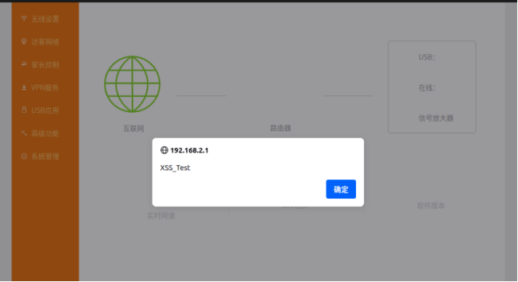

# Information

**Vendor of the products:**    Tenda

**Vendor's website:**    https://www.tenda.com.cn

**Reported by:**    YanKang、ChenZhijin、WeiKanghong

**Affected products:**	Tenda AC18 router

**Affected firmware version:**	V15.03.05.05_multi

**Firmware download address:** 	https://www.tenda.com.cn/material/show/2610

# Overview

A stored cross-site scripting (XSS) vulnerability was discovered in `Tenda AC18 routers（V15.03.05.05_multi）`. The vulnerability exists in the `ssid` parameter of the `wireless settings`. Remote attackers can inject malicious payloads that execute when any user visits the router's homepage, leading to session hijacking and potential complete compromise of the router.

# Exp

The exploitation process begins when an attacker, after obtaining valid credentials and authenticating via `/login.html`, submits a crafted POST request to the `/goform/WifiBasicSet` endpoint to inject a malicious JavaScript payload into the `ssid` parameter. This payload is then permanently stored in the router's  configuration without proper sanitization and persists across reboots.  Subsequently, when any authenticated user, including administrators,  visits the main dashboard at `/main.html`, the  stored script automatically executes within their browser session,  enabling session hijacking, authentication token theft, and potential  full administrative control of the router.

```
POST /goform/WifiBasicSet HTTP/1.1
Host: 192.168.2.1
Content-Length: 207
X-Requested-With: XMLHttpRequest
Accept-Language: zh-CN,zh;q=0.9
Accept: */*
Content-Type: application/x-www-form-urlencoded; charset=UTF-8
User-Agent: Mozilla/5.0 (Windows NT 10.0; Win64; x64) AppleWebKit/537.36 (KHTML, like Gecko) Chrome/131.0.6778.140 Safari/537.36
Origin: http://192.168.2.1
Referer: http://192.168.2.1/wireless_ssid.html
Accept-Encoding: gzip, deflate, br
Cookie: password=25d55ad283aa400af464c76d713c07adrmn1qw; bLanguage=cn
Connection: keep-alive

wrlEn=1&wrlEn_5g=1&security=wpawpa2psk&security_5g=wpawpa2psk&ssid=Tenda_FD3AA0<script>alert('XSS_Test')</script>&ssid_5g=Tenda_FD3AA0_5G&hideSsid=0&hideSsid_5g=0&wrlPwd=12345678&wrlPwd_5g=12345678
```

# Attack Demo

The complete attack flow involves the following steps:

1.**Initial Access:** An attacker first obtains valid credentials and authenticates to the router's web interface via the `/login.html` page.


2.**Payload Injection:** The attacker submits a specially crafted POST request to the `/goform/WifiBasicSet` endpoint, injecting a malicious JavaScript payload into the `ssid` parameter.


3.**Trigger Condition:** The vulnerability is triggered when any authenticated user (including administrators) simply visits the main dashboard page at `/main.html`.




# Supplement

The attacker can use the `storage type XSS attack` to obtain the `cookie` of the user who just logged in through `/login.html`. Then, he can forge cookies to perform operations that can only be performed by administrators, causing serious consequences.
